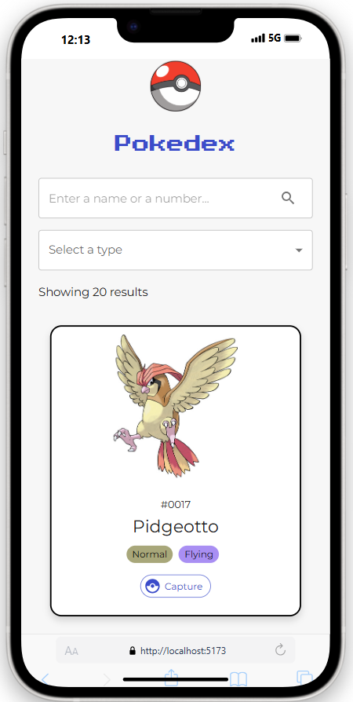

# Pokedex
> Project under construction

This project is a **full-stack application** built with `NodeJS, Express, MongoDB, Mongoose, GraphQL, React and Mui`.
The purpose of this project is to serve as a practice to get familiar with `GraphQL`.

## Features
### User can view all pokemon cards


### User can search pokemons by name, number or type


### Ongoing improvements
- [ ] Add pagination component

## Backend

### Prerequisites
Provide in the `.env` the MongoDB uri and a JWT secret for JWT generation

```
MONGO_URI=
ALLOWED_ORIGIN=
```

- For `ALLOWED_ORIGIN` specify the frontend url, example : `ALLOWED_ORIGIN=http://localhost:5173`


### Installation and Setup Instructions

You will need `node` and `npm` installed globally on your machine.

Move to frontend folder:
`cd ./backend`

Installation:

`npm install`


To Start Server:

`npm start`

Server is running on PORT:

`http://localhost:8080/`

### Usage
TODO


## Frontend

### Prerequisites
Provide in the `.env` the backend url.

```
VITE_BACKEND_API_URL=http://localhost:8080
```

- For `VITE_BACKEND_API_URL` specify the backend url.

### Installation and Setup Instructions

You will need `node` and `npm` installed globally on your machine.

Move to frontend folder:
`cd ./frontend`

Installation:

`npm install`


To Start Server:

`npm run dev`

To Visit App:

`http://localhost:5173/`

### Acknowledgement
This project took strong inspiration from the following resources :
- https://github.com/dgraph-io/graphql-sample-apps/tree/master/pokedex